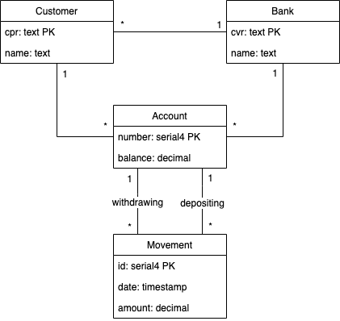

# Assignment 3
_____

## The well-tested bank

### Group members:
* Adam Lass
* Rasmus Helsgaun
* Pernille Lørup

____
#### Implementation 

In this project we have made a fake of the data access layer (DBFacade) to illustrate CRUD-operations and connecting to the database. 

The interface IDBFacade describes the methods needed for a real implementation, which is not in the scope of this assignment. 

We have also created tests for successful and failed scenarios of the different operations. 

Additionally we have used the annotations Before and After to setup and tear down the database. 

#### Process

In the process of our implementation we had a test-driven approach to make sure everything is tested. 

#### Diagram

In the diagram below there is an illustration of our database.

